# 📚 BOB Prompt Library

<div align="center">


**Una moderna applicazione web per gestire, organizzare e sincronizzare i tuoi prompt AI**

[Caratteristiche](#-caratteristiche) •
[Demo](#-demo) •
[Installazione](#-installazione-rapida) •
[Documentazione](#-documentazione) •
[Deploy](#-deployment)

</div>

---

## 🎯 Panoramica

**BOB Prompt Library** è un'applicazione web full-stack progettata per professionisti che lavorano con AI e necessitano di un sistema robusto per gestire i propri prompt. Costruita con tecnologie moderne e best practices, offre un'esperienza utente fluida sia su desktop che mobile.

### 🎨 Design Principles

- **Mobile-First**: Interfaccia ottimizzata per smartphone e tablet
- **Performance**: Caricamento istantaneo con lazy loading e code splitting
- **Accessibilità**: Conforme agli standard WCAG 2.1
- **Scalabilità**: Architettura modulare pronta per crescere

---

## ✨ Caratteristiche

### 🔐 Autenticazione e Sicurezza
- Sistema di login protetto con credenziali configurabili
- Session management con `sessionStorage`
- Row Level Security (RLS) su Supabase
- Protezione CSRF e XSS

### 📂 Gestione Prompt
- **CRUD Completo**: Crea, leggi, aggiorna ed elimina prompt
- **Categorizzazione Dinamica**: Organizza per categoria e tipologia
- **Sistema di Tag**: Etichetta i prompt con tag personalizzabili
- **Preferiti**: Marca i prompt più utilizzati
- **Ricerca Full-Text**: Cerca per titolo o contenuto
- **Ordinamento Avanzato**: Per data, alfabetico (A-Z, Z-A)

### 🎨 User Experience
- **Copia con un Click**: Copia i prompt negli appunti istantaneamente
- **Toast Notifications**: Feedback visivo per ogni azione
- **Modal Responsive**: Form ottimizzati per mobile e desktop
- **Filtri Multipli**: Combina categoria, tipo e ricerca
- **Dark Mode Ready**: Preparato per tema scuro

### ☁️ Cloud & Sincronizzazione
- **Supabase Integration**: Database PostgreSQL cloud-based
- **Offline-First**: Funziona anche senza connessione (mock data)
- **Real-time Sync**: Aggiornamenti in tempo reale (opzionale)
- **Auto-save**: Salvataggio automatico delle modifiche

---

## 🚀 Installazione Rapida

### Prerequisiti

```bash
Node.js >= 18.0.0
npm >= 9.0.0
```

### Setup Locale

```bash
# 1. Clona il repository
git clone https://github.com/tuousername/bob-prompt-library.git
cd bob-prompt-library

# 2. Installa le dipendenze
npm install

# 3. Configura le variabili d'ambiente (opzionale)
cp .env.example .env
# Modifica .env con le tue credenziali Supabase

# 4. Avvia il server di sviluppo
npm run dev
```

L'applicazione sarà disponibile su `http://localhost:5173`

### Credenziali di Default

```
Username: admin
Password: changeme123
```

> ⚠️ **IMPORTANTE**: Modifica le credenziali in `src/auth.config.js` prima del deploy in produzione!

---

## 🏗️ Architettura

### Stack Tecnologico

| Tecnologia | Versione | Scopo |
|------------|----------|-------|
| **React** | 19.2.0 | UI Framework |
| **Vite** | 7.2.4 | Build Tool & Dev Server |
| **Supabase** | 2.84.0 | Backend as a Service |
| **Tailwind CSS** | 4.1.17 | Utility-First CSS |
| **Lucide React** | 0.554.0 | Icon Library |
| **PostCSS** | 8.5.6 | CSS Processing |

### Struttura del Progetto

```
bob-prompt-library/
├── src/
│   ├── components/          # Componenti React riutilizzabili
│   │   ├── AdminModal.jsx   # Modal CRUD per prompt
│   │   ├── CategoryMenu.jsx # Menu categorie orizzontale
│   │   ├── FilterBar.jsx    # Barra filtri tipologie
│   │   ├── Header.jsx       # Header con menu e logout
│   │   ├── Login.jsx        # Schermata autenticazione
│   │   ├── PromptCard.jsx   # Card singolo prompt
│   │   ├── SearchBar.jsx    # Barra di ricerca
│   │   ├── SettingsModal.jsx # Gestione categorie/tipologie
│   │   ├── SortDropdown.jsx # Dropdown ordinamento
│   │   └── Toast.jsx        # Sistema notifiche
│   ├── lib/
│   │   └── supabase.js      # Client Supabase configurato
│   ├── App.jsx              # Componente root
│   ├── auth.config.js       # Configurazione autenticazione
│   ├── index.css            # Stili globali Tailwind
│   └── main.jsx             # Entry point applicazione
├── public/                  # Asset statici
├── dist/                    # Build di produzione (generata)
├── schema.sql               # Schema database Supabase
├── guida.md                 # Documentazione completa (ITA)
├── .env.example             # Template variabili d'ambiente
├── vite.config.js           # Configurazione Vite
├── tailwind.config.js       # Configurazione Tailwind
├── postcss.config.js        # Configurazione PostCSS
├── eslint.config.js         # Configurazione ESLint
└── package.json             # Dipendenze e scripts
```

### Flusso Dati

```mermaid
graph LR
    A[Browser] --> B[React App]
    B --> C{Supabase Configurato?}
    C -->|Sì| D[Supabase Database]
    C -->|No| E[Mock Data]
    D --> F[PostgreSQL]
    F --> G[RLS Policies]
    B --> H[Components]
    H --> I[PromptCard]
    H --> J[AdminModal]
    H --> K[CategoryMenu]
```



---

## 🗄️ Database Schema

### Tabelle Principali

#### `prompts`
```sql
- id: UUID (PK)
- title: TEXT
- content: TEXT
- category: TEXT
- type: TEXT
- is_favorite: BOOLEAN
- created_at: TIMESTAMP
- updated_at: TIMESTAMP
```

#### `categories`
```sql
- id: UUID (PK)
- name: TEXT (UNIQUE)
- created_at: TIMESTAMP
```

#### `types`
```sql
- id: UUID (PK)
- name: TEXT (UNIQUE)
- created_at: TIMESTAMP
```

#### `prompt_tags`
```sql
- id: UUID (PK)
- name: TEXT (UNIQUE)
- created_at: TIMESTAMP
```

### Setup Database

1. Crea un progetto su [Supabase](https://supabase.com)
2. Apri SQL Editor
3. Esegui il contenuto di `schema.sql`
4. Copia le credenziali API in `.env`

```env
VITE_SUPABASE_URL=https://your-project.supabase.co
VITE_SUPABASE_ANON_KEY=your-anon-key
```

---

## 🛠️ Scripts Disponibili

```bash
# Sviluppo
npm run dev          # Avvia dev server (http://localhost:5173)

# Build
npm run build        # Crea build di produzione in /dist

# Preview
npm run preview      # Anteprima build di produzione

# Linting
npm run lint         # Esegue ESLint

# Pulizia
rm -rf node_modules package-lock.json && npm install
```

---

## 📦 Deployment

### Vercel (Consigliato)

```bash
# 1. Installa Vercel CLI
npm i -g vercel

# 2. Deploy
vercel

# 3. Configura variabili d'ambiente su Vercel Dashboard
# VITE_SUPABASE_URL
# VITE_SUPABASE_ANON_KEY
```

### Netlify

```bash
# 1. Build
npm run build

# 2. Deploy
npx netlify-cli deploy --prod --dir=dist
```

### Server Linux (Nginx)

```bash
# 1. Build locale
npm run build

# 2. Upload via SCP
scp -r dist/* user@server:/var/www/bob-prompt-library/

# 3. Configurazione Nginx
server {
    listen 80;
    server_name your-domain.com;
    root /var/www/bob-prompt-library;
    index index.html;
    
    location / {
        try_files $uri $uri/ /index.html;
    }
    
    gzip on;
    gzip_types text/css application/javascript application/json;
}
```

### Docker

```dockerfile
FROM node:18-alpine AS builder
WORKDIR /app
COPY package*.json ./
RUN npm ci
COPY . .
RUN npm run build

FROM nginx:alpine
COPY --from=builder /app/dist /usr/share/nginx/html
COPY nginx.conf /etc/nginx/conf.d/default.conf
EXPOSE 80
CMD ["nginx", "-g", "daemon off;"]
```

---

## 🔧 Configurazione

### Modifica Credenziali Login

Modifica `src/auth.config.js`:

```javascript
export const AUTH_CONFIG = {
  username: 'your-username',
  password: 'your-secure-password'
};
```

### Personalizzazione Tema

Modifica `tailwind.config.js`:

```javascript
export default {
  theme: {
    extend: {
      colors: {
        primary: '#4F46E5',    // Indigo
        secondary: '#10B981',  // Green
      }
    }
  }
}
```

### Variabili d'Ambiente

Crea `.env` nella root:

```env
# Supabase Configuration
VITE_SUPABASE_URL=https://your-project.supabase.co
VITE_SUPABASE_ANON_KEY=your-anon-key

# Optional: Analytics
VITE_GA_TRACKING_ID=UA-XXXXXXXXX-X
```

---

## 📚 Documentazione

- **[Guida Completa](./guida.md)** - Documentazione dettagliata in italiano
- **[Schema Database](./schema.sql)** - SQL schema per Supabase
- **[API Reference](#)** - Documentazione API (coming soon)

---

## 🧪 Testing

```bash
# Unit Tests (coming soon)
npm run test

# E2E Tests (coming soon)
npm run test:e2e

# Coverage
npm run test:coverage
```

---

## 🤝 Contribuire

I contributi sono benvenuti! Per favore segui questi step:

1. Fork il progetto
2. Crea un branch per la feature (`git checkout -b feature/AmazingFeature`)
3. Commit le modifiche (`git commit -m 'Add some AmazingFeature'`)
4. Push al branch (`git push origin feature/AmazingFeature`)
5. Apri una Pull Request

### Coding Standards

- **ESLint**: Segui le regole definite in `eslint.config.js`
- **Prettier**: Formattazione automatica
- **Commit Messages**: Usa [Conventional Commits](https://www.conventionalcommits.org/)

---

## 🐛 Bug Reports & Feature Requests

Usa [GitHub Issues](https://github.com/tuousername/bob-prompt-library/issues) per:
- 🐛 Segnalare bug
- 💡 Proporre nuove feature
- 📖 Migliorare la documentazione

---

## 📈 Roadmap

- [x] CRUD completo prompt
- [x] Sistema categorie e tipologie
- [x] Ricerca e filtri
- [x] Ordinamento
- [x] Integrazione Supabase
- [ ] Dark Mode
- [ ] Esportazione/Importazione JSON
- [ ] Condivisione prompt via link
- [ ] Versioning dei prompt
- [ ] Multi-utente con autenticazione Supabase
- [ ] PWA (Progressive Web App)
- [ ] API REST pubblica
- [ ] Plugin per browser

---

## 📄 Licenza

Questo progetto è distribuito sotto licenza **MIT**. Vedi il file [LICENSE](./LICENSE) per maggiori dettagli.

---

## 👨‍💻 Autore

**Il tuo nome**
- GitHub: [@tuousername](https://github.com/tuousername)
- Email: tua@email.com
- Website: [tuosito.com](https://tuosito.com)

---

## 🙏 Ringraziamenti

- [React](https://react.dev/) - UI Framework
- [Vite](https://vitejs.dev/) - Build Tool
- [Supabase](https://supabase.com/) - Backend as a Service
- [Tailwind CSS](https://tailwindcss.com/) - CSS Framework
- [Lucide](https://lucide.dev/) - Icon Library

---

## 📊 Stats


---

<div align="center">

**Fatto con ❤️ e ☕ da sviluppatori per sviluppatori**

[⬆ Torna su](#-bob-prompt-library)

</div>